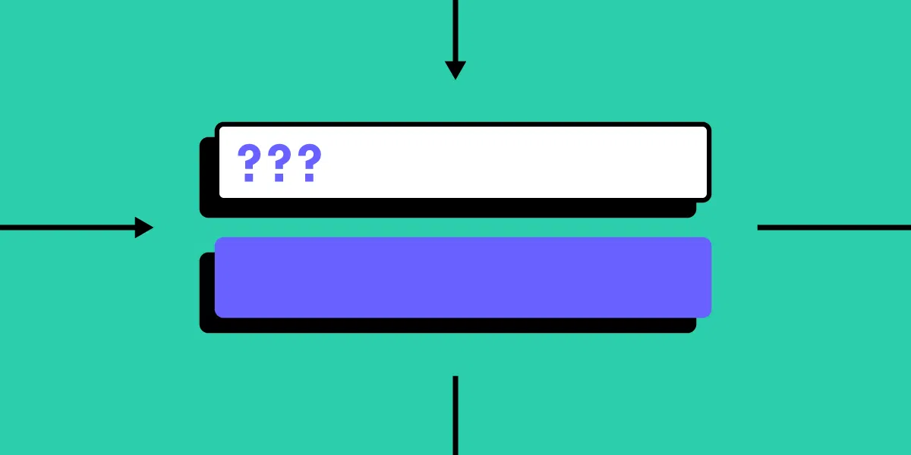

import { Tabs, Tab, Callout } from "nextra/components";

# Relational Form Fields



In some cases, one form field need to be controlled by another field or other fields.
For example: `isMarriage` checkbox may appear after user input their sex.

## Use watch

To achieve this logic, watch is necessary.

```js
export default {
  data() {
    return {
      formData: {},
    };
  },
  watch: {
    "formData.sex": {
      handler(newVal) {
        // do something here
      },
      immediate: true,
    },
  },
};
```

## Computed new form-item list

To control visibility of `form-fields`, we use `v-for` loop render them from a computed array,
in which is fields that is visible.

<Tabs items={['template', 'script']}>
<Tab>
```vue
<template>
  <el-form :model="formData">
    <el-form-item
      v-for="({ name, label, comp }, index) in filteredFields"
      :name="name"
      :label="label"
      :key="index"
    >
      <component
        :is="comp"
        v-model="formData[name]"
      />
    </el-form-item>
  </el-form>
</template>
```
</Tab>
<Tab>
```js
export default {
  data() {
    return {
      formData: {},
      fields: [
        {
          name: "sex",
          label: "sex",
          comp: "el-input",
        },
        {
          name: "isMarried",
          label: "isMarried",
          comp: "el-checkbox",
        },
      ],
      hiddenFieldsNames: []
    };
  },
  computed: {
    filteredFields:() {
      return this.fields.filtered((fields) => {
        return !this.hiddenFieldsNames.includes(field.name)
      });
    }
  }
};
```
</Tab>
</Tabs>

## Remove and Restore

When you want a field be hidden, push the keys into the `hiddenFieldsNames` array.

```js
export default {
  methods: {
    removeField(name) {
      const index = this.fields.findIndex((field) => field.name === name);

      if (index !== -1) {
        this.hiddenFieldsNames = uniq([...this.hiddenFieldsNames, name]);
      }
    },
  },
};
```

<Callout type="info">
  `uniq`: Creates a duplicate-free version of an array.
  [[Detail]](https://lodash.com/docs/#uniq)
</Callout>

## Controlled by multiple fields

Use `computed` wrap them for `watch`.

```js {14,}
export default {
  computed: {
    conditionForFieldD() {
      return {
        A: this.formData["A"],
        B: this.formData["B"],
        C: this.formData["C"],
      };
    },
  },
  watch: {
    conditionForFieldD: {
      handler(newVal) {
        // do something
      },
      immediate: true,
      deep: true,
    },
  },
};
```
